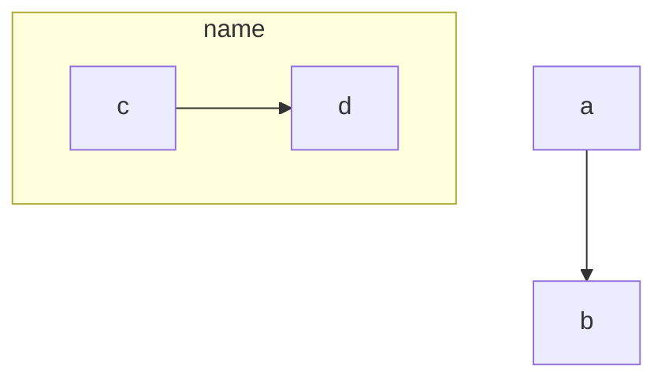

# gl-vdi-containers
An exploration of hardware accelerated, GL (e.g. OpenGL, GLX, EGL, etc.) capable VDI (Virtual Desktop Infrastructure) OCI (Open Container Initiative) containers (i.e. docker, podman, k8s)

## Executive Summary

<details open>
<summary>Click to collapse/expand section </summary>

### Introduction

This experiment delves into the synergistic potential of combining powerful graphical processing with the versatility and scalability of containerized environments. By harnessing the capabilities of Docker, Podman, and Kubernetes, this initiative aims to redefine the boundaries of virtualized workstations, offering unprecedented computational and graphical resources. The focus is on enabling a robust, scalable, and efficient infrastructure that caters to the demanding needs of various high-performance computing tasks in industries ranging from scientific research to game development and beyond.

### Objectives

The primary objective of this experiment is to establish a scalable, reliable, and high-performance VDI environment that can adapt to the rigorous demands of diverse computational and graphical tasks. Specifically, it seeks to:

### Technology Overview

At the core of this experiment lies a sophisticated technology stack designed to leverage the best of both hardware acceleration and software graphical acceleration libaries (e.g. OpenGL).

OCI containers, known for their lightweight and portable nature, are optimized to tap into the host's GPU resources, enhancing the performance of graphical tasks. 
Docker, Podman, and Kubernetes are employed to manage these containers, providing a robust and scalable framework that ensures resources are utilized efficiently and reliably.

#### TODO
- [ ] **TODO** This section will delve into how each component contributes to the overall system, outlining the architecture and the interplay between hardware acceleration, GL capabilities, and container management tools.
- [ ] **TODO** some blurb about how this is linux only but maybe could be used for windows containers as well
- [ ] **TODO** High level (e.g. c4 context) diagrams go here



### Use Cases

Key use cases include:

- Scientific Computing: Accelerating simulations and visualizations to aid in complex research and analysis.
- Game Development: Offering the power needed for real-time rendering and physics simulations.
- CAD: Improving the speed and quality of 3D modeling and engineering designs.
- Artistic Rendering: Enabling artists to create more intricate and detailed 3D scenes.

**TODO** A few pictures/gifs here

### Benefits

This technology stack brings a multitude of benefits to the table, including but not limited to:

- Scalability: Easily adapts to varying workload sizes, making it suitable for both small teams and large enterprises.
- Reliability: Ensures consistent performance and uptime, critical for time-sensitive and mission-critical tasks.
- Performance: Significantly boosts the speed and quality of graphical and computational processes.
- Efficiency: Optimizes resource usage, potentially reducing operational costs and environmental impact.
- Accessibility: Enables users to access high-powered computing resources from virtually anywhere.

### Current Status and Preliminary Results

- [ ] **TODO**

### Future Directions

- [ ] **TODO**

### Conclusion

- [ ] **TODO**

</details>

## Tests

<details open>
<summary>Click to collapse/expand section</summary>

### Test Machines Setup

### NICE DCV

### x11docker

#### Using host X server
#### Using X server running in an isolated container (`-xc`)

### TurboVNC + VirtualGL

</details>

## Appendix

<details open>
<summary>Click to collapse/expand section</summary>

### I. Data 

- [ ] **TODO** raw data tables go here

### II. Links Reference

1. [TODO](example.com)
 
#### Random links to organize and reference later:

random context:
- [gnome remote desktop shortcoming: requiring active user session](https://www.reddit.com/r/gnome/comments/17jfxfu/remote_desktop_vnc_etc_into_gnome_desktop/)
  - related issue in upstream: https://gitlab.gnome.org/GNOME/gnome-remote-desktop/-/issues/92 

TurboVNC
- [turbovnc install instructions](https://turbovnc.org/Downloads/YUM)
- [turbovnc supported desktop envs](https://turbovnc.org/Documentation/Compatibility30)
- [turbovnc official docs](https://rawcdn.githack.com/TurboVNC/turbovnc/main/doc/index.html)
- 
- 

VirtualGL
- [virtual gl "docker container" issue](https://github.com/VirtualGL/virtualgl/issues/113)
- [virtual gl "x server in docker" issue](https://github.com/VirtualGL/virtualgl/issues/98)
- [virtual gl avail in fedora repo, not rocky](https://pkgs.org/download/VirtualGL)

> ```
>   server:                                                              client:
>  ······················································               ················
>  : ┌───────────┐ X11 commands         ┌─────────────┐ : image stream  : ┌──────────┐ :
>  : │application│━━━━━━━━━━━━━━━━━━━━━▶│VNC server 2)│━━━━━━━━━━━━━━━━━━▶│VNC viewer│ :
>  : │           │        ┌───────────┐ └─────────────┘ :               : └──────────┘ :
>  : │           │        │X server 1)│        ▲        :               :              :
>  : │ ╭┈┈┈┈┈┈┈┈┈┤ OpenGL │ ╭┈┈┈┈┈┈┈┈┈┤ images ┃        :               :              :
>  : │ ┊VirtualGL│━━━━━━━▶│ ┊VirtualGL│━━━━━━━━┛        :               :              :
>  : └─┴─────────┘        └─┴─────────┘                 :               :              :
>  ······················································               ················
> ```
> 1. "3D" rendering happens here
> 2. "2D" rendering happens here
>
> - Source: https://wiki.archlinux.org/title/VirtualGL#With_VNC (GNU Free Documentation License 1.3 or later)

x11docker
- [Run with --gpu option and fail to get a glx context (remote server with NVIDIA GPU) ](https://github.com/mviereck/x11docker/issues/337)
- [how to vnc with unity3d in docker?](https://github.com/mviereck/x11docker/issues/190)
- [How to choose discrete gpu on optimus laptop?](https://github.com/mviereck/x11docker/issues/394)
- [Container applications running in Browser with HTML5](https://github.com/mviereck/x11docker/wiki/Container-applications-running-in-Browser-with-HTML5)
- [dependencies by context](https://github.com/mviereck/x11docker/wiki/Dependencies#dependencies-of-feature-options)
- [list of xserver and wayland CLI options](https://github.com/mviereck/x11docker/wiki/X-server-and-Wayland-Options)

> ``` bash
> #! /bin/bash
> read Xenv < <(x11docker --xvfb --printenv --showenv x11docker/lxde)
> env $Xenv x11vnc -noshm -forever -localhost -rfbport 5910
> ```
> Source: https://github.com/mviereck/x11docker/wiki/VNC

xpra
- [ffeldhaus/docker-xpra-minimal](https://github.com/ffeldhaus/docker-xpra-minimal)
- [ffeldhaus/docker-xpra-html5-gpu-minimal](https://github.com/ffeldhaus/docker-xpra-html5-gpu-minimal)
- [Xpra-org/xpra-html5](https://github.com/Xpra-org/xpra-html5)


### III. Repository Setup
The state of many remote dependencies were captured directly in this git repository using the git subtree tool.

The Git subtree approach was chosen for its superior handling of complex project dependencies and ease of use compared to Git submodules.
Unlike submodules, which maintain a separate project history and require explicit commands to sync and update, subtrees integrate the contents of one repository into a subdirectory of another, preserving a single, cohesive project history.
This simplifies the process of making changes and ensures that all project components are consistently synchronized without the need for additional Git commands.
While submodules are more detached and suitable for loosely coupled project dependencies, subtrees provide a more integrated and straightforward approach. 


Additionally, subtrees facilitate comprehensive searching through all dependencies of the project, allowing developers to navigate and understand the codebase more effectively. 
This approach safeguards against potential issues with upstream Git repositories rewriting history and removing commits, a notable downfall of submodules. 
By embedding the dependency's history within the main project, subtrees ensure that the exact version of the code is always accessible, regardless of external changes. 
This feature is particularly beneficial for maintaining long-term stability and traceability in the project. 
Furthermore, since subtrees include the dependency's source directly in the project, it simplifies the build process at runtime, potentially making rebuilds faster and more reliable.
Unlike submodules, which require separate checkouts, subtrees ensure that all needed files are immediately present, reducing the complexity and time involved in preparing the environment for development or deployment. 
This can lead to more efficient workflows, especially in continuous integration/continuous deployment (CI/CD) pipelines where every second counts.

The commands used to initialize the repo are:

```shell

# docker-headless-vnc-container
git subtree add --prefix vnc-container/docker-headless-vnc-container https://github.com/ConSol/docker-headless-vnc-container.git master --squash

# NICE DCV
git subtree add --prefix dcv/aws-batch-using-nice-dcv  https://github.com/aws-samples/aws-batch-using-nice-dcv.git master --squash

# phoronix-test-suite
## todo current HEAD of main branch is at 5177940, but with 46 extra commits. may want to go there at some point, but rolling with latest released version for now for easier test consistency across envs (EL has v10.8.4 available in EPEL) 
git subtree add --prefix phoronix-test-suite/phoronix-test-suite https://github.com/phoronix-test-suite/phoronix-test-suite.git v10.8.4 --squash

# TurboVNC
git subtree add --prefix turbovnc/turbovnc https://github.com/TurboVNC/turbovnc.git 3.1 --squash

# VirtualGL
git subtree add --prefix virtualgl/virtualgl https://github.com/VirtualGL/virtualgl.git 3.1 --squash

# x11docker
## TODO rolling with latest state of main branch as this was initial tested as demonstrably working. may want to check out specific versions of this in the future.
git subtree add --prefix x11docker/x11docker https://github.com/mviereck/x11docker.git master  --squash
git subtree add --prefix x11docker/x11docker-gnome https://github.com/mviereck/dockerfile-x11docker-gnome.git master  --squash
git subtree add --prefix x11docker/x11docker-xfce https://github.com/mviereck/dockerfile-x11docker-xfce.git master  --squash
git subtree add --prefix x11docker/x11docker-xserver https://github.com/mviereck/dockerfile-x11docker-xserver.git master --squash


```

Updates to the remote dependency can be later pulled in with commands like. for example, to switch the `x11docker/x11docker` dependency to release tag `v7.6.0`, run:

```shell
git subtree pull --prefix x11docker/x11docker https://github.com/mviereck/x11docker.git master v7.6.0  --squash

```

See more information at sources like https://www.atlassian.com/git/tutorials/git-subtree

</details>